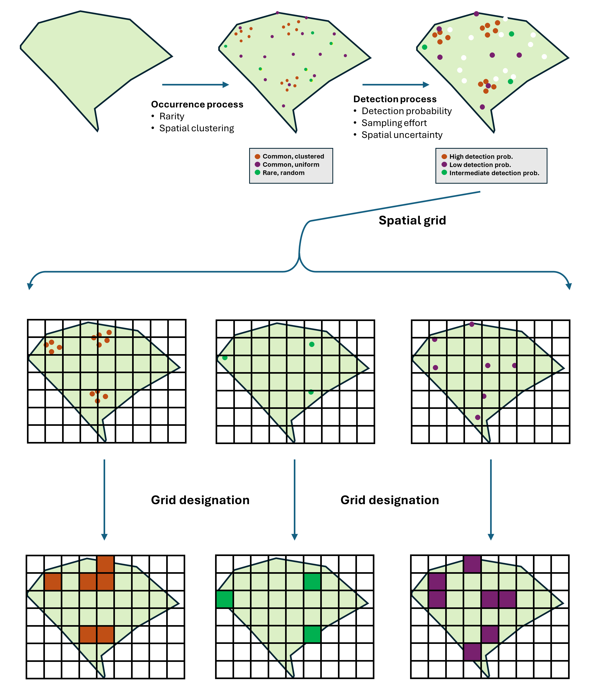
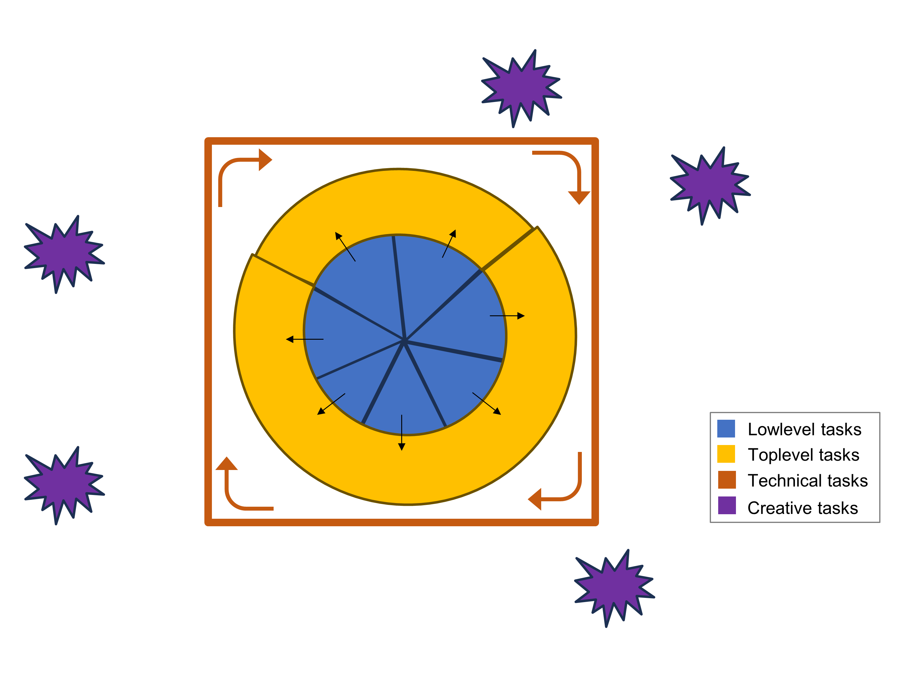
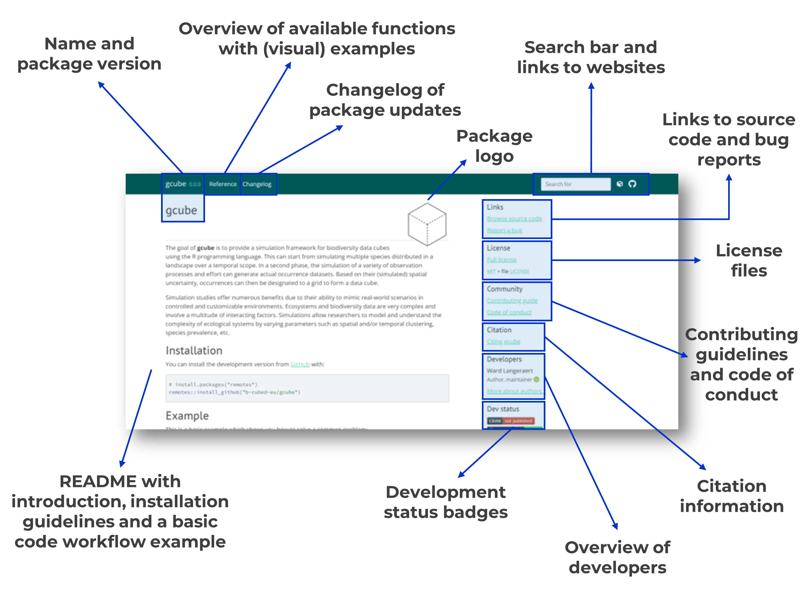
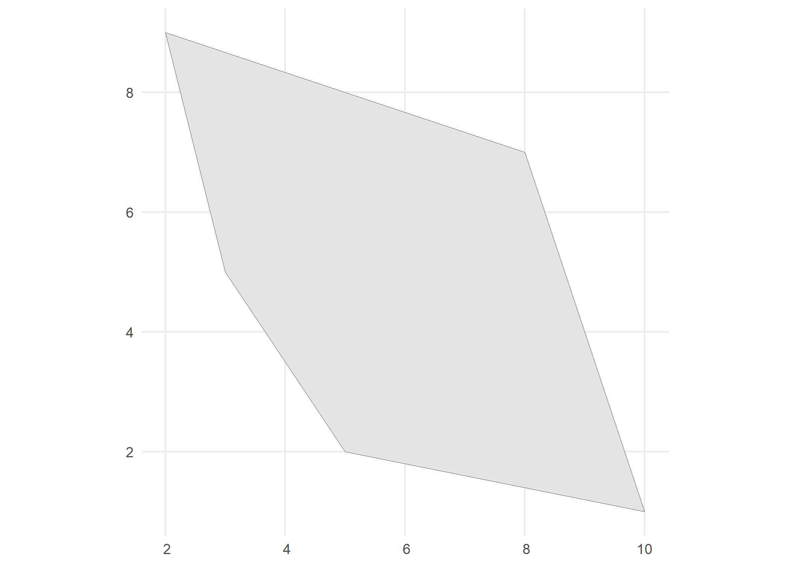
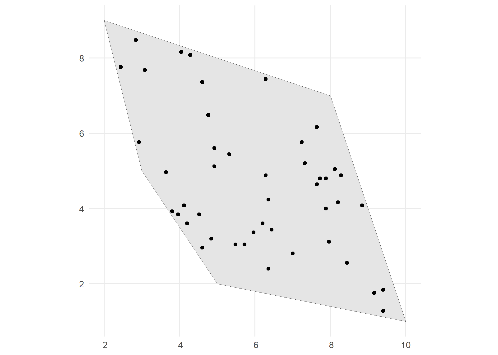
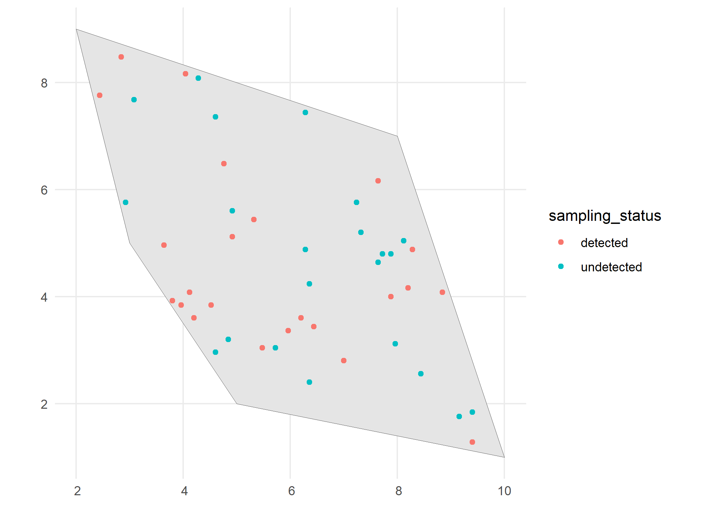
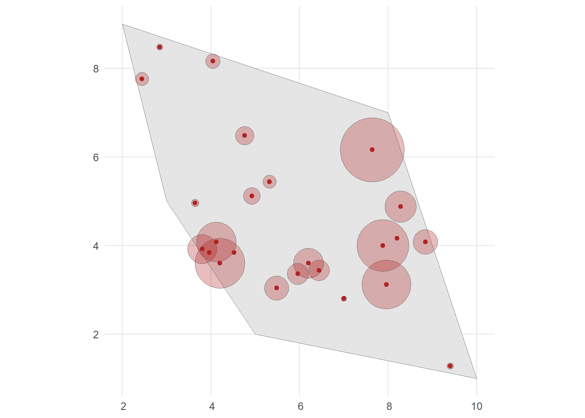
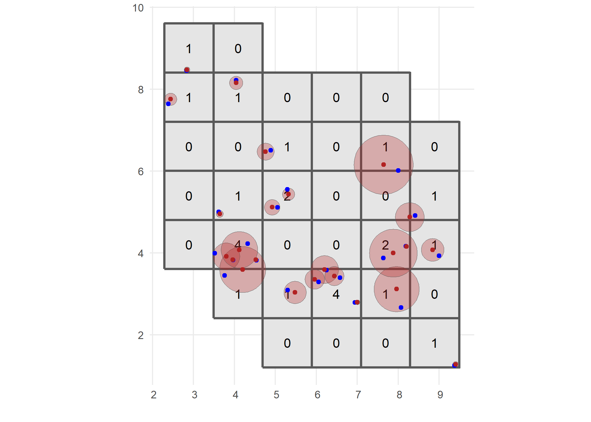
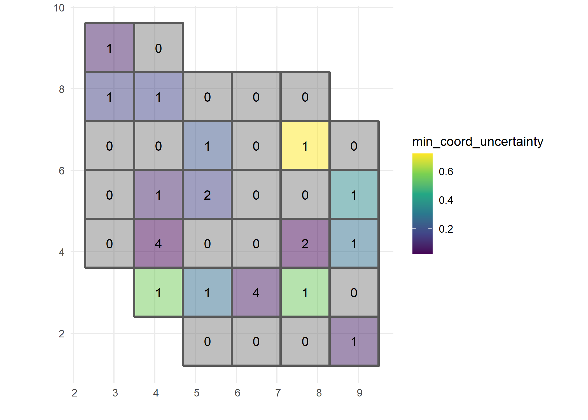

------------------------------------------------------------------------

\* Corresponding author:
[ward.langeraert\@inbo.be](mailto:ward.langeraert@inbo.be){.email}

#### Keywords:

Simulation, Data cubes, Biodiversity, B-Cubed, Monte-Carlo, R package

------------------------------------------------------------------------

## Abstract

...

## Introduction
Simulation studies offer numerous benefits due to their ability to mimic real-world scenarios in controlled and customizable environments. Ecosystems and biodiversity data are very complex and involve a multitude of interacting factors. Simulations allow researchers to model and to understand the effects of the complexity of ecological systems by varying parameters such as spatial and/or temporal clustering, species prevalence, etc.

During the B-Cubed Hackathon (Hacking Biodiversity Data Cubes for Policy), we aimed to create a practical simulation framework for biodiversity data cubes based on Monte Carlo methods (= based on repeated random sampling). This framework is composed of three steps ([Fig. 1](#Figure_1)):

1. The occurrence process: Simulating occurrences of multiple species distributed in a landscape over a temporal scope. This will depend on the **rarity**, which can differ between species and over time, and their **spatial clustering**, which can differ between species. A challenge for this part is to implement a consistent **spatial and temporal autocorrelation** for simulated species trends.
2. The detection process: Simulation of a variety of observation processes can generate actual occurrence datasets. Each species has a different **detection probability**. The detection process will also depend on the **sampling effort** which can be different among spatial and temporal dimensions. We can also assign a spatial uncertainty to each observation.
3. The grid designation process: Based on their spatial uncertainty, occurrences can be designated to grid cells of a larger grid to form a data cube.

The simulation framework can be used to assess multiple research questions under different parameter settings, such as the effect of clustering on occurrence-to-grid designation and the effect of different patterns of missingness on data quality and indicator robustness. Simulation studies can incorporate scenarios with missing data, enabling researchers to assess the impact of data gaps on analyses. Understanding how missing data influences results is crucial for improving data collection strategies and addressing potential biases. With this, the secondary objective of the simulation study is to develop a visualisation tool for the simulated cubes. This tool aims to enhance the understanding of data clustering and missingness within the simulated environment. By creating a visual representation, researchers can effectively aid to interpret patterns of clustered data as well as identify areas where data is missing. This visualization capability contributes to a more comprehensive exploration of the simulated scenarios, allowing for deeper insights into the behaviour of data within the context of the study.

The B-Cubed Hackathon took place from 2-5 April 2024. This paper describes the methods and results of projects 2+8 during this hackathon unless mentioned otherwise. The final commit hash of the GitHub repo is given at the end of this paper. Some function and argument names might be slighty different in this paper, because they were changed shortly after the hackathon and are used here as such to improve clarity.

{#Figure_1
.Figure}

## Materials and Methods
### Technical setup
It was *a priori* decided by the first author to build the simulation framework using the R programming language as an R package [@R2024lang], where participants could collaborate efficiently with each other via GitHub (https://github.com/).
A repository for this package was prepared under the name 'simcuber' and a code structure was proposed for the framework (see next subsection).

Common guidelines for software development (e.g. related to coding style, function naming and unit testing) were mentioned to ensure efficient collaboration as well as future maintenance and development [@huybrechts2024guidelines].

### Code architecture
General code architecture of the package was proposed following preparation of the hackathon by the first author.
As indicated in the introduction, the simulation framework and thus the R package can be divided into three consecutive processes related to different variables that depend on *species*, *observation*, *space* and *time*.

1. occurrence process
2. detection process
3. grid designation process

For grid designation, R code was already available as the function `grid_designation()`. The focus of the hackathon was thus on the occurrence and detection processes.

|   Process  |        Variable        |   Dependency  |
|------------|------------------------|---------------|
| occurrence | rarity                 | species, time |
| occurrence | spatial clustering     | species       |
| detection  | detection probability  | species       |
| detection  | sampling effort        | space, time   |
| detection  | spatial uncertainty    | observation   |

The three processes can be described in three main functions respectively `simulate_occurrences()`, `sample_observations()` and `grid_designation()`. Each main function consists of multiple supporting functions, for example per variable mentioned above or for specific subprocesses (e.g. temporal autocorrelation).

Some (pseudo)code and ideas for implementation were provided by the first author for `simulate_occurrences()` and `sample_observations()` on the first day.

**1. Occurrence process**

``` r
simulate_occurrences(
  polygon,
  initial_average_abundance = 50,
  spatial_autocorr = c("random", "clustered", "regular"),
  n_time_points = 10,
  temporal_autocorr = ifelse(time_points ==  1, NA, "random_walk"),
  spatiotemporal_autocorr = NA,
  seed = NA
)
```

- **polygon**:

An sf object with POLYGON geometry indicating the spatial extend to simulate occurrences.

- **initial_average_abundance**:

A positive integer value indicating the average number of occurrences to be simulated within the extend of `polygon` at time point 1. This value will be used as mean of a Poisson distribution ($\lambda$ parameter).

- **spatial_autocorr**:

`"random"`, `"clustered"`, `"regular"` or a numeric value between -1 and 1 representing Moran's I. `"random"` corresponds to 0, `"clustered"` to 0.9 and `"regular"` to -0.9.

- **n_time_points**:

A positive integer value indicating the number of time points to simulate.

- **temporal_autocorr**:

`NA`, `"random_walk"` or a function which generates a trend in abundance over time. Only used if `time_points > 1`. When there are multiple time points and `"random_walk"` is selected, an internal function can be used to create a random walk over time. The user is also free to specify its own function that depends on `initial_average_abundance` and `n_time_points`, e.g. a linearly decreasing trend over time.

- **spatiotemporal_autocorr**:

A numeric value between indicating the strength of spatiotemporal autocorrelation.

- **seed**:

A positive numeric value. The seed for random number generation to make results reproducible. If `NA` (the default), no seed is used.

**2. Detection process**

``` r
sample_observations(
  occurrences,
  detection_probability = 1,
  sampling_bias = c("no_bias", "polygon", "manual"),
  bias_area = NA,
  bias_strength = NA,
  bias_weights = NA,
  coordinate_uncertainty_meters = 25,
  seed = NA
)
```

- **occurrences**:

An sf object with POINT geometry.

- **detection_probability**:

A numeric value between 0 and 1, corresponding to the probability of detection of the species.

- **sampling_bias**:

`"no_bias"`, `"polygon"` or `"manual"`. The method used to generate a sampling bias (cf. the **virtualspecies** package @leroy2016virtualspecies). `"polygon"`: bias the sampling in a polygon. Provide your polygon to `bias_area`. Provide bias strength to `bias_strength`. `"manual"`: bias the sampling manually via a raster. Provide your raster layer in which each cell contains the probability to be sampled to `bias_weights`.

- **bias_area**:

`NA` or an sf object with POLYGON geometry. Only used if `sampling_bias = "polygon"`. The area in which the sampling will be biased.

- **bias_strength**:

`NA` or a positive numeric value. Only used if `sampling_bias = "polygon"`. The strength of the bias to be applied in the biased area (as a multiplier). Above 1, area will be oversampled. Below 1, area will be undersampled. For example, a value of 50 will result in 50 times more samples within the `bias_area` than outside. Conversely, a value of 0.5 will result in half less samples within the `bias_area` than outside.

- **bias_weights**:

`NA` or a raster layer (sf object with POLYGON geometry, or SpatRaster object). Only used if `sampling_bias = "manual"`. The raster of bias weights to be applied to the sampling of occurrences. Higher weights mean a higher probability of sampling. Weights can be numeric values between 0 and 1 or positive integers that will be rescaled to values between 0 and 1.

- **coordinate_uncertainty_meters**:

A positive numeric value or vector with length `nrow(occurrences)` describing the uncertainty in meters around each observation.

- **seed**:

A positive numeric value. The seed for random number generation to make results reproducible. If `NA` (the default), no seed is used.

Finally, we also have the function `add_coordinate_uncertainty()`.

``` r   
add_coordinate_uncertainty(
  occurrences,
  coordinate_uncertainty_meters = 25
)
```

This function is a supporting function for `sample_observations()` to add a `coordinateUncertaintyInMeters` column that should also be exported in case users simulate observations based on virtual species distributions. This can for example be accomplished using the **virtualspecies** package [@leroy2016virtualspecies]:

1.  Species-environment relationship
    -   `generateSpFromFun()`
    -   `generateSpFromPCA()`
2.  Conversion to presence-absence
    -   `convertToPA()`
    -   introduce distribution bias: `limitDispersal()`
3.  Sample occurrences
    -   `sampleOccurrences()`
4.  Convert to sf object with POINT geometry
    -   `sf::st_as_sf()`
    -   create helper function `virtualspecies_to_sf()`?

### Collaboration and division of tasks
Following the information provided in the previous subsections, four types of tasks were distinguished ([Fig. 2](#Figure_2)).

1. **Low level tasks**: Tasks related to supporting and helper functions of the high level functions `simulate_occurrences()` and `sample_observations()`. They were the first priority of the development process during the hackathon.

|             Task         |                    Description               |      High level relation    |
|--------------------------|----------------------------------------------|-----------------------------|
| spatial autocorrelation  | add spatial autocorrelation helper function  | occurrence process function |
| temporal autocorrelation | add temporal autocorrelation helper function | occurrence process function |
| detection probability    | implement detection probability              | detection process function  |
| sampling bias            | add sampling bias helper function            | detection process function  |
| coordinate uncertainty   | add coordinate uncertainty helper function   | detection process function  |

2. **High level tasks**: These tasks combine the low level functions into the main, high level functions `simulate_occurrences()` and `sample_observations()`. They were the final priority of the development process during the hackathon.

|         Task         |                                 Description                                  |
|----------------------|------------------------------------------------------------------------------|
| simulate occurrences | combine supporting and helper functions in `simulate_occurrences()` function |
| sample observations  | combine supporting and helper functions in `sample_observations()` function  |

3. **Technical tasks**: These tasks encompass general code development and testing. They were required throughout the development process of the hackathon.

|        Task       |                 Description                    |
|-------------------|------------------------------------------------|
| unit tests        | create unit tests and calculate code coverage  |
| documentation     | maintain function and package documentation    |
| pkgdown website   | maintain pkgdown website [@pkgdown2024wickham] |
| GitHub repository | maintain GitHub repository                     |

4. **Creative tasks**: Other tasks that require out of the box or creative thinking and which are (mainly) independent from other tasks. Participants were encouraged to come up with interesting applications and links to other frameworks/concepts/software/... These tasks could be done throughout the development process of the hackathon.

|              Task              |                               Description                     |
|--------------------------------|---------------------------------------------------------------|
| spatiotemporal autocorrelation | add spatiotemporal autocorrelation helper function            |
| virtualspecies                 | link to **virtualspecies** package [@leroy2016virtualspecies] |
| vignettes                      | create vignettes                                              |
| ...                            | ...                                                           |

{#Figure_2 .Figure width=500px}

Using a Google Form we got an overview of participants' interest in the different tasks, and an idea where a potential shortage of coverage might occur. Tasks were divided and followed up via a simple scrum methodology by using sticky notes (coloured by task type) on a board. The board was divided in four parts (from left to right): 'Ice Box', 'In Progress', 'Review', and 'Complete'. The 'Ice Box' is where all the potential tasks and ideas were stored before they were prioritized and selected for development. The 'In Progress' category contains tasks that the team was actively working on during development. The 'Review' category is for tasks that have been completed but are awaiting review, testing, or approval. The 'Complete' category includes tasks that have been reviewed, approved, and finalized. Participants were free to choose and add tasks to the scrum board, indicating the task and their name on the sticky note.

## Results
### Collaboration
This was the general timing of activities during the hackathon. In total, we had about 6 half days of coding time.

| Day | Part      | Activities                                                                                              |
|-----|-----------|---------------------------------------------------------------------------------------------------------|
| 1   | Morning   | General hackathon introduction and presentations.                                                       |
|     | Afternoon | Create project group. Acquaintance with participants and presentation of the objectives of the project. |
|     |           |                                                                                                         |
| 2   | Morning   | Division of tasks and start of code development.                                                        |
|     | Afternoon | Continued code development.                                                                             |
|     |           |                                                                                                         |
| 3   | Morning   | Further code development.                                                                               |
|     | Afternoon | Continued code development.                                                                             |
|     |           |                                                                                                         |
| 4   | Morning   | Code review and pull request merging.                                                                   |
|     | Afternoon | Final presentations of all hackathon projects.                                                          |

After discussion with the participants, the R package was renamed to **gcube** which stands for ‘generate cube’ since it can be used to generate biodiversity data cubes from minimal input.

Tasks were efficiently distributed along the participants ([Fig. 3](#Figure_3)). In total, we collaborated with fourteen people pushing 209 commits to the main branch and 300 commits to all branches. On main, 56 files were changed and there have been 2,856 additions and 373 deletions. By the end of the hackathon, we had a functional pkgdown website ([Fig. 4](#Figure_4)), all CMD checks passed, and we had a code coverage of 67%.

{#Figure_3 .Figure}

{#Figure_4 .Figure}

### R package development
The biodiversity data cube simulation workflow of **gcube** is divided in three steps or processes:

1.  Occurrence process
2.  Detection process
3.  Grid designation process

The three processes are executed by three main functions `simulate_occurrences()`, `sample_observations()` and `grid_designation()`, respectively. The functions are designed such that a single polygon as input is enough to go through this workflow using default arguments. An example workflow is given in the next section. In this subsection, we give a more technical overview of the functions that were developed. The three functions all have a `seed` argument used to allow for reproducible results. If `NA` (the default), no seed is used.

**1. Occurrence process**

The `simulate_occurrences()` function generates occurrences of a species within a given spatial and/or temporal extend.

``` r
simulate_occurrences(
  plgn,
  initial_average_occurrences = 50,
  spatial_autocorr = c("random", "clustered"),
  n_time_points = 1,
  temporal_function = NA,
  ...,
  seed = NA
)
```

The input (`plgn`) should be an sf object with POLYGON geometry indicating the spatial extend to simulate occurrences.

The temporal component of this function is executed by the `simulate_timeseries()` supporting function.

``` r
simulate_timeseries(
  initial_average_occurrences = 50,
  n_time_points = 1,
  temporal_function = NA,
  ...,
  seed = NA
)
```

The initial number of occurrences (`initial_average_occurrences`) and temporal trend function (`temporal_function`) generate a number of occurrences for each time point (total number of time points is given by `n_time_points`). If the temporal function is `NA` (default), it will sample `n_time_points` times from a Poisson distribution with average equal to `initial_average_occurrences`. You can also specify a function which generates a trend in number of occurrences over time. This can be the internal function `simulate_random_walk()` or a custom function that takes `initial_average_occurrences` and `n_time_points` as arguments. Additional arguments for the temporal function can be passed to the ellipsis argument (`...`). The specified temporal function will calculate a number of occurrences for each time point according to a certain function (e.g. a random walk in case of `temporal_function = simulate_random_walk`) and draw this from a Poisson distribution

The spatial component of `simulate_occurrences()` is executed by the `create_spatial_pattern()` and `sample_occurrences_from_raster()` supporting functions. 

``` r
create_spatial_pattern(
  polygon,
  resolution,
  spatial_pattern = c("random", "clustered"),
  seed = NA,
  n_sim = 1
)
```

`create_spatial_pattern()` creates a raster for the area of a polygon (`polygon`) with a resolution (`resolution`) according to a spatial patter `spatial_pattern`. `"random"` is the default pattern. The user is able to provide a numeric value >= 1 (1 is "random" and 10 is "clustered"). A larger number means a broader size of the clusters. This number changes the range parameter of the spherical variogram model. `spatial_pattern = 1` means the range has the same size of the grid cell, which is defined in resolution argument (calculated by `simulate_timeseries()` as one hundredth of the extend of the polygon). We use the function `gstat::vgm()` to implement the spherical variogram model [@gstat2016Graler].

``` r
sample_occurrences_from_raster(
  rs,
  ts,
  seed = NA
)
```

The raster output of `create_spatial_pattern()` is then used as input for `sample_occurrences_from_raster()` (`rs`). From this raster, it samples a number of occurrences (`ts`) as provided by `simulate_timeseries()` for each time point using `terra::spatSample()` [@terra2024hijmans]. The final result is thus a number of occurrences sampled from a spatial pattern for multiple time points which is passed as output for `simulate_occurrences()`.

**2. Detection process**

We have our occurrences, but not all occurrences are generally observed. The detection of occurrences depends on the detection probability of a species and the sampling bias (includes both sampling bias and effort). This process is simulated using the `sample_observations()` function.

``` r
sample_observations(
  occurrences,
  detection_probability = 1,
  sampling_bias = c("no_bias", "polygon", "manual"),
  bias_area = NA,
  bias_strength = 1,
  bias_weights = NA,
  seed = NA
)
```

Detection probability (`detection_probability`) is be passed as a numeric value between 0 and 1. For sampling bias there are three options specified in `sampling_bias` (cf. @leroy2016virtualspecies).

1. With `"no_bias"`, only the detection probability value will decide whether an occurrence is observed or not. If `detection_probability = 1` and `sampling_bias = "no_bias"`, all occurrences are detected.
2. With `"polygon"`, bias weights depend on their location inside or outside a given polygon with a certain bias strength. This is accomplished by the supporting function `apply_polygon_sampling_bias()`.

``` r
apply_polygon_sampling_bias(
  occurrences_sf,
  bias_area,
  bias_strength = 1
)
```

The function adds a sampling bias weight column to an sf object with POINT geometry containing the occurrences (`occurrences_sf`). This column contains the sample probability based on bias strength `bias_strength` within a given polygon `bias_area`. The bias strength is the strength of the bias to be applied in the biased area (as a multiplier). Above 1, the area will be oversampled. Below 1, the area will be undersampled. For example, a value of 50 will result in 50 times more samples within the `bias_area` than outside. Conversely, a value of 0.5 will result in half less samples.

3. With `"manual"`, bias weights depend on their location inside grid cells of a given grid where each cell has its own value. This is accomplished by the supporting function `apply_manual_sampling_bias()`.

``` r
apply_manual_sampling_bias(
  occurrences_sf,
  bias_weight
)
```

The function adds a sampling bias weight column to an sf object with POINT geometry containing the occurrences (`occurrences_sf`). This column contains the sample probability based on bias weights within each cell of a given grid layer (`bias_weight`).

`sample_observations()` combines detection probability and sampling bias weight to a single value `p` as a product and uses this to draw for each occurrence from `stats::rbinom(1, 1, p)` [@R2024lang] to decide whether an occurrence is observed or not.

To mimic real life data collection, we can select observed occurrences and add coordinate uncertainty with the `add_coordinate_uncertainty()` function. This is optional.

``` r
add_coordinate_uncertainty(
  observations,
  coords_uncertainty_meters = 25
)
```

This is done by adding an additional column to the observed occurrences (`observations`). This column contains numeric values (passed to `coords_uncertainty_meters` as one value or a vector of values) indicating the coordinate uncertainty in meters around each observation.

**3. Grid designation process**

Now that we have our observations, we designate them to a grid while taking into account the coordinate uncertainty in meters around the observation if present. This function was already developed by the first author before the hackathon started, but is given here for the sake of completeness.

``` r
grid_designation(
  observations,
  grid,
  id_col = "row_names",
  seed = NA,
  aggregate = TRUE,
  randomisation = c("uniform", "normal"),
  p_norm = ifelse(tolower(randomisation[1]) == "uniform", NA, 0.95)
)
```

This function designates observations (`observations`) to cells of a given grid (`grid`) to create a data cube. `id_col` specifies the column name of the column with unique ids for each grid cell. If `id_col = "row_names"` (the default), a new column `id` is created where the row names represent the unique ids. If `aggregate = TRUE` (default), return data cube in aggregated form (grid with number of observations per grid cell). Otherwise, return sampled points in uncertainty circle. The randomisation method, specified with `randomisation`, is used for sampling within uncertainty circle around each observation. By default `"uniform"` which means each point uncertainty circle has an equal probability to be selected. If no coordinate uncertainty is present, the function takes the point itself for designation. The other option is `"normal"` where a point is sampled from a bivariate Normal distribution with means equal to the observation point and the variance equal to (-`coordinateUncertaintyInMeters`^2) / (2 * log(1 - `p_norm`)) such that `p_norm` % of all possible samples from this Normal distribution fall within the uncertainty circle. `p_norm` is only used if `randomisation = "normal"` and has the default value of 0.95. Uniform is the standard method to create biodiversity data cubes. The normal randomisation is an experimental feature.

The following imports and suggests were used. Packages listed under 'imports' are essential for the package to function and are automatically loaded when **gcube** is loaded. Packages listed under 'suggests' are not essential for the basic functionality of the package but are useful for certain optional features, examples, or tests. These packages are not automatically loaded when **gcube** is loaded.

|   Type   |   Package    |           Source                 |
|----------|--------------|----------------------------------|
| imports  | **cli**      | [@cli2024csardi]                 |
| imports  | **dplyr**    | [@dplyr2023wickham]              |
| imports  | **gstat**    | [@gstat2016Graler]               |
| imports  | **magrittr** | [@magrittr2022bache]             |
| imports  | **methods**  | [@R2024lang]                     |
| imports  | **mnormt**   | [@mnormt2022azzalini]            |
| imports  | **rlang**    | [@rlang2024henry]                |
| imports  | **sf**       | [@sf2018pebesma; @sf2023pebesma] |
| imports  | **stats**    | [@R2024lang]                     |
| imports  | **terra**    | [@terra2024hijmans]              |
| imports  | **vegan**    | [@vegan2024oskanen]              |
| imports  | **withr**    | [@withr2024hester]               |
| suggests | **ggplot2**  | [@ggplot2016wickham]             |
| suggests | **testthat** | [@testthat2011wickham]           |

### Incorporation of virtual species to the simulation workflow
Project 8 originally aimed to address the challenges of incomplete and unreliable biodiversity data which hinder accurate species distribution models (SDMs). By creating virtual species with known ecological characteristics, researchers can simulate and analyse the effects of spatial, temporal, and taxonomic uncertainties. This "virtual ecologist" approach helps quantify sources of error and refine modelling techniques. The goal is to improve conservation planning, especially for rare or endangered species, by providing more reliable predictions of species distributions under various environmental conditions, including climate change.

At an early stage of the hackathon, it was decided to integrate the concepts and ideas developed by this group would be integrated into the cube simulation package of group 2. This decision was influenced by the existing proposal to incorporate a virtual species workflow using the **virtualspecies** package, as mentioned above. The focus was primarily on discussions, conceptualization, and experimentation with the code of both the **virtualspecies** package and the **gcube** package as it was being developed at the time.

The idea of working with a virtual species approach in **gcube**, is that simulations can start from two points.

1. Original **gcube** workflow: Start from empty polygon and mathematical concepts.
2. **virtualspecies** workflow: Start from environmental data layers.

We identified the needs for future development of the virtual species approach. Link functions are required that accept output from the **virtualspecies** package and provide input for the three main simulation functions of **gcube**.

| **virtualspecies** function(s) | **virtualspecies** output | Link function **gcube** | **gcube** function(s) |
|--------------------------------|---------------------------|-------------------------|-----------------------|
| `generateSpFromFun()` or `generateSpFromPCA()` | environmental suitability map | `rescale_suitability_raster()`?  | `simulate_occurrences()` |
| `convertToPA()` | presence-absence map | `occurrences_from_raster()`? | `sample_observations()` |
| `sampleOccurrences()` | sampled presence points | `virtual_occurrences_to_sf()`? | `add_coordinate_uncertainty()` and/or `grid_designation()` |

This was mainly conceptual and not implemented in the package yet.

## gcube workflow example
This is a basic example from the README which shows the workflow for simulating a biodiversity data cube using the **gcube** package. An example for one time point for a single species (the default). This is not the exact README example from the hackathon, but a cleaned version from the week after. It uses the exact code as developed during the hackathon, but at that time we did not have enough time to create a clean README example.

The functions are designed such that a single polygon as input is enough to go through this workflow using default arguments. The user can change these arguments to allow for more flexibility.

``` r
# Load packages
library(gcube)

library(sf)      # working with spatial objects
library(dplyr)   # data wrangling
library(ggplot2) # visualisation with ggplot
```

We create an arbitrary polygon as input.

``` r
# Create a polygon to simulate occurrences
polygon <- st_polygon(list(cbind(c(5, 10, 8, 2, 3, 5), c(2, 1, 7,9, 5, 2))))

# Visualise
ggplot() + 
  geom_sf(data = polygon) +
  theme_minimal()
```

{width=400px}

**1. Occurrence process**

We generate occurrence points within the polygon using the
`simulate_occurrences()` function. These are the “real” occurrences of
the species, whether we have observed them or not. In the
`simulate_occurrences()` function, the user can specify different levels
of spatial clustering, and can define the trend change of the species
over time.

``` r
# Simulate occurrences within polygon
occurrences_df <- simulate_occurrences(
  plgn = polygon,
  seed = 123)
#> [using unconditional Gaussian simulation]

# Visualise
ggplot() + 
  geom_sf(data = polygon) +
  geom_sf(data = occurrences_df) +
  theme_minimal()
```
{width=400px}

**2. Detection process**

In this step we define the sampling process, based on the detection
probability of the species and the sampling bias. This is done using the
`sample_observations()` function. The default sampling bias is
`"no_bias"`, but bias can also be inserted using a polygon or a grid.

``` r
# Detect occurrences
detections_df_raw <- sample_observations(
  occurrences = occurrences_df,
  detection_probability = 0.5,
  seed = 123)

# Visualise
ggplot() + 
  geom_sf(data = polygon) +
  geom_sf(data = detections_df_raw,
          aes(colour = sampling_status)) +
  theme_minimal()
```

{width=400px}

We select the detected occurrences and add an uncertainty to these
observations. This can be done using the `add_coordinate_uncertainty()`
function.

``` r
# Select detected occurrences only
detections_df <- detections_df_raw %>%
  dplyr::filter(sampling_status == "detected")

# Add coordinate uncertainty
set.seed(123)
coord_uncertainty_vec <- rgamma(nrow(detections_df), shape = 2, rate = 6)
observations_df <- add_coordinate_uncertainty(
  observations = detections_df,
  coords_uncertainty_meters = coord_uncertainty_vec)

# Created and sf object with uncertainty circles to visualise
buffered_observations <- st_buffer(
  observations_df,
  observations_df$coordinateUncertaintyInMeters)

# Visualise
ggplot() + 
  geom_sf(data = polygon) +
  geom_sf(data = buffered_observations,
          fill = alpha("firebrick", 0.3)) +
  geom_sf(data = observations_df, colour = "firebrick") +
  theme_minimal()
```

{width=400px}

**3. Grid designation process**

Finally, observations are designated to a grid to create an occurrence
cube. We create a grid over the spatial extend using
`sf::st_make_grid()`.

``` r
# Define a grid over spatial extend
grid_df <- st_make_grid(
    buffered_observations,
    square = TRUE,
    cellsize = c(1.2, 1.2)
  ) %>%
  st_sf() %>%
  mutate(intersect = as.vector(st_intersects(geometry, polygon,
                                             sparse = FALSE))) %>%
  dplyr::filter(intersect == TRUE) %>%
  dplyr::select(-"intersect")
```

To create an occurrence cube, `grid_designation()` will randomly take a
point within the uncertainty circle around the observations. These
points can be extracted by setting the argument `aggregate = FALSE`.

``` r
# Create occurrence cube
occurrence_cube_df <- grid_designation(
  observations = observations_df,
  grid = grid_df,
  seed = 123)

# Get sampled points within uncertainty circle
sampled_points <- grid_designation(
  observations = observations_df,
  grid = grid_df,
  aggregate = FALSE,
  seed = 123)

# Visualise grid designation
ggplot() +
  geom_sf(data = occurrence_cube_df, linewidth = 1) +
  geom_sf_text(data = occurrence_cube_df, aes(label = n)) +
  geom_sf(data = buffered_observations,
          fill = alpha("firebrick", 0.3)) +
  geom_sf(data = sampled_points, colour = "blue") +
  geom_sf(data = observations_df, colour = "firebrick") +
  labs(x = "", y = "", fill = "n") +
  theme_minimal()
```

{width=400px}

The output gives the number of observations per grid cell and minimal
coordinate uncertainty per grid cell.

``` r
# Visualise minimal coordinate uncertainty
ggplot() +
  geom_sf(data = occurrence_cube_df, aes(fill = min_coord_uncertainty),
          alpha = 0.5, linewidth = 1) +
  geom_sf_text(data = occurrence_cube_df, aes(label = n)) +
  scale_fill_continuous(type = "viridis") +
  labs(x = "", y = "") +
  theme_minimal()
```

{width=400px}

## Discussion

...

## Conclusions and future work

- summarise take away message

- to do after the hackathon
  - clean-up code
  
  - vignettes
  
  - multispecies
  
  - implement virtual species
  
  - unit tests for all functions
  
  - documentation complete
  
  - issues: e.g. bugs: crs, improvements: column names, enhancements: spatial pattern, spatiotemporal connection

## Links to software
- gcube repo

- Commit hash meegeven van einde hackathon: reference point
https://github.com/b-cubed-eu/gcube/commit/6cceb2b229ac25d1df47a9c3a2e20b464f827e18
if function names or arguments are differentin this paper, it is because it was changed shortly after the hackathon and is used here as such to improve clarity

- current pkgdown website and say that at the time of writing this, there is a version 0.1.0 with vignettes etc.

## Acknowledgements
We would like to express our gratitude to the Horizon Europe funded B-Cubed (Biodiversity Building Blocks for policy) project for the organisation of this hackathon.
Special thanks go to Laura Abraham of Meise Botanic Garden for her outstanding efforts in coordinating the event.
Additionally, we acknowledge the Research Foundation - Flanders (FWO) and KU Leuven for the support they gave us in making this event possible.

## References